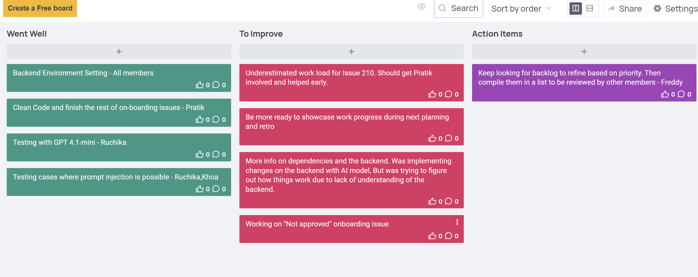

## Research & Learn

### How does a Kanban board work, and how does it help manage workflow?
A Kanban board is a visual tool used to manage workflow by representing tasks as cards and the stages of work as columns. It helps teams track the status of work items, identify bottlenecks at a glance, and improve the flow of work from start to finish. The board promotes transparency, as everyone can see what is being worked on, what is next, and what has been completed.

### What do the different columns on a Kanban board represent?
The columns typically represent stages of the workflow. Common examples include:  
- **Backlog**: tasks identified but not yet started.  
- **In Progress**: tasks actively being worked on.  
- **Blocked**: tasks that cannot proceed due to an issue or dependency.  
- **Done**: tasks that have been completed and meet the agreed definition of done.  

### How do tasks move through the board, and who is responsible for updating them?
Tasks move from left to right as work progresses. Each team member is responsible for moving their task cards when they start or complete work, ensuring the board accurately reflects the current status. In collaborative situations, updates may also be made by other team members when agreed upon.

### What are the benefits of limiting work in progress (WIP)?
Limiting WIP ensures the team focuses on completing tasks before starting new ones. This reduces context-switching, prevents overloading the team, and helps identify bottlenecks earlier.

---

## Reflection

### How does Kanban help manage priorities and avoid overload?
Kanban helps by making work visible and ensuring that the most important tasks are pulled into the workflow first. The visual layout of the board allows teams to see which items are urgent or high-value, enabling better decision-making about what to work on next. By applying WIP limits, Kanban prevents team members from taking on too many tasks at once, which reduces multitasking and the risk of delays. This focus on completing existing work before starting new items helps avoid overload, maintains a steady pace, and ensures consistent delivery of value.

### How can I improve my workflow using Kanban Principles?
By keeping my task board up to date and ensuring that I only work on a few items at a time, following WIP limits. I will prioritise tasks based on their value and deadlines, moving them across the board as progress is made to maintain an accurate view of my workload. Additionally, I will regularly review the board to identify bottlenecks or stalled items and address them quickly.

**Example from practice:** On the Focus Bear Kanban board, I moved the task *“Update Internship Time Plan”* from *Backlog → In Progress* when I began working on it, and then to *Done* once I submitted the file. During our retrospective board. This showed me how tasks move through the board and how Kanban ensures feedback leads to concrete outcomes.

*Figure 1: Kanban's worlflow*

**Planned improvement:** I will start breaking down larger tasks (such as *On boarding issues”*) into smaller subtasks (*“Issue 1”*, *“Issue 2”*, *“Check Unapproved tasks”*). This will make progress easier to track, prevent tasks from getting stuck in *In Progress* for too long, and help me spot bottlenecks earlier.
