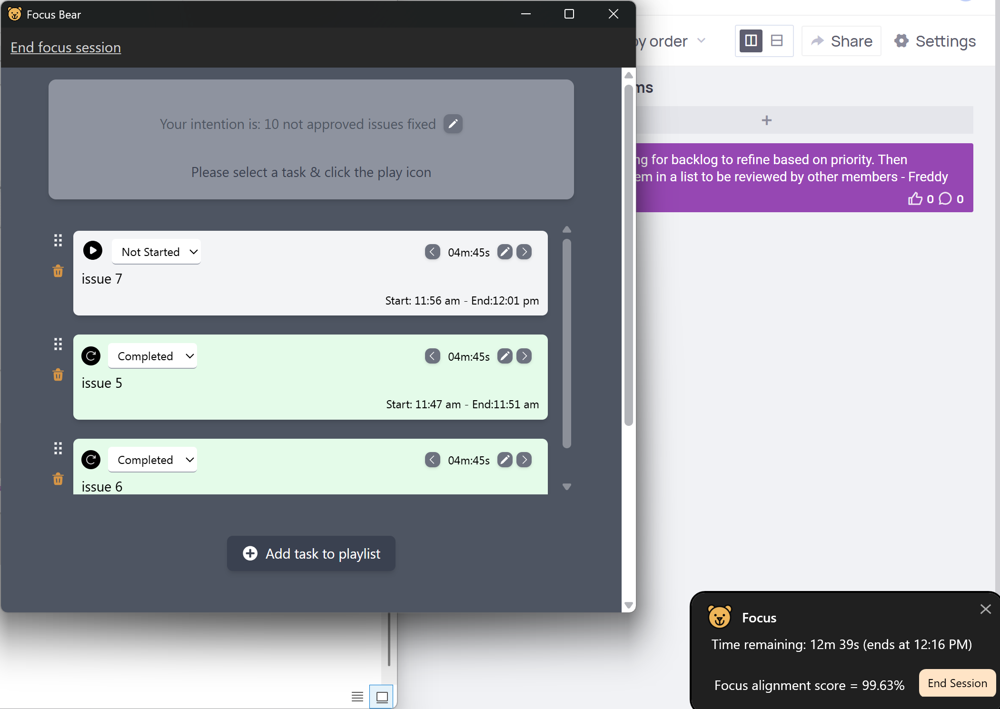
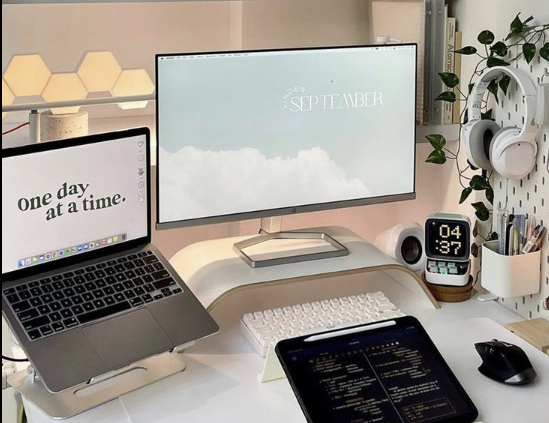

## Research & Learn

### What are the risks of using a laptop without an external monitor or keyboard?
Using a laptop without an external monitor or keyboard can cause neck strain, shoulder tension, eye fatigue, and poor wrist positioning. Because the screen is usually too low and the built-in keyboard is compact, I often have to look down and keep my hands too close together, which over time can contribute to repetitive strain injuries and poor posture.

### What ergonomics equipment can improve posture when working on a laptop?
A laptop stand or an external monitor to raise the screen to eye level, an external keyboard and mouse to position hands and wrists naturally, and an adjustable chair with lumbar support.

### What adjustments should be made to monitor height, chair position, and desk setup for a healthier workspace?
To create a healthier workspace, the top of the monitor should be at or just below eye level and positioned about an arm's length away. The chair height should be adjusted so my feet are flat on the floor with knees at roughly 90 degrees. My desk setup should keep elbows close to my body, bent at about 90 degrees, and wrists straight while typing or using a mouse.

### What are some daily habits that reduce the impact of prolonged laptop use?
Take short standing or stretching breaks every hour, alternate between sitting and standing if possible, and maintain good posture with relaxed shoulders and a supported back.

---

## Reflection

### What equipment changes can I make to improve my workspace setup?
I plan to add a laptop stand and adjust my chair to ensure my screen is at eye level and my posture is supported. I will also be mindful of sitting with my back against the chair, keeping the screen directly in front of me, and avoiding slouching.

### What behavioral changes can I implement to improve posture and reduce strain?
I will take regular breaks to stand, stretch, and move around. I will also consciously relax my shoulders, keep my wrists straight, and adjust my sitting position throughout the day to avoid staying in one posture for too long.

### How can I remind myself to maintain good posture and take breaks throughout the day?
By using the Focus Bear app, which allows me to stay focused on tasks, avoid distractions, and receive reminders to take breaks and adjust my posture.

---

## Task

### Habit adjustment I made:
I used the Focus Bear app to set a recurring 30-minute timer during work sessions to remind me to stand, stretch, and check my posture.

  
*Figure 1: Screenshot of Focus Bear reminder with 30-minute posture check timer.*  

  
*Figure 2: Picture of my desk setup with ergonomic adjustments.*
