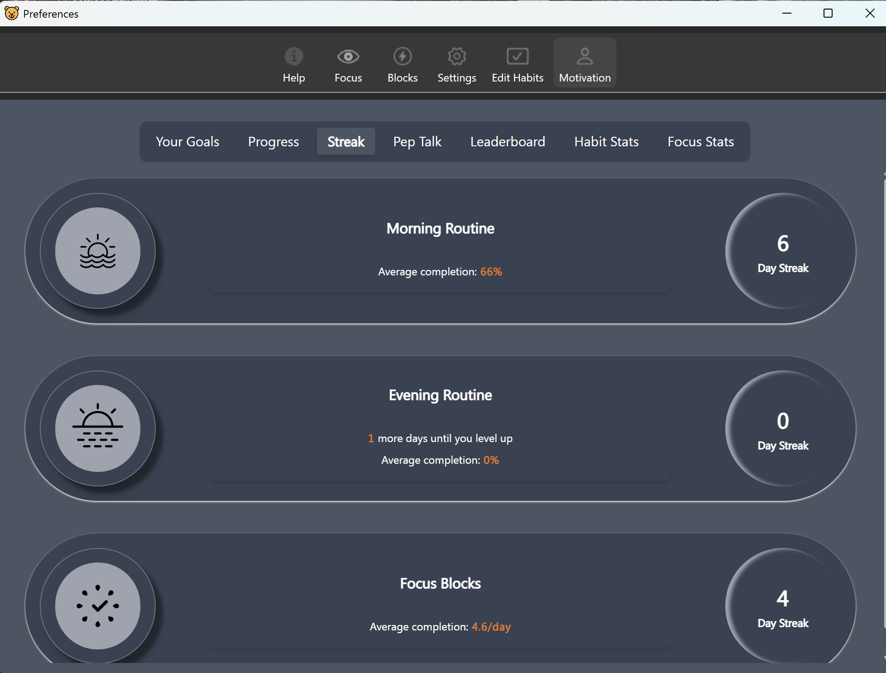
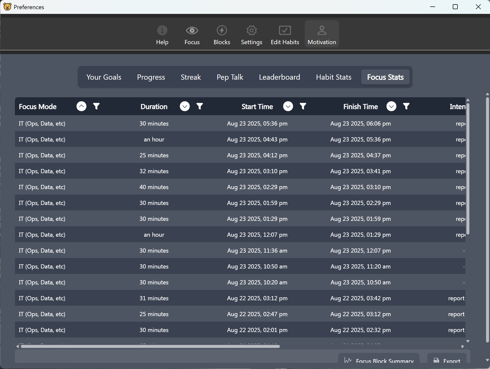

# Internship time plan:
## Working pattern
- Monday: 9:00 - 16:00 (Swinburne New Latelab)
- Thursday: 9:00 - 16:00 (TA or TD building)
- Saturday & Sunday: Only required to meet weekly hour target (Remote: Home or Deakin's library)

## Evidence of Time logging

*Figure 1: Screenshot of Focus Bear logged hours*

*Figure 2: Detailed logged hours table*
