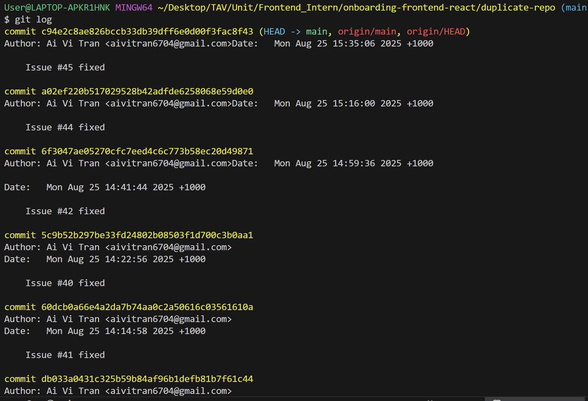

## What makes a good commit message?
A good commit message is:
- Clear, concise, adn descriptive of the change.
- Written in the imperative forms
- Explains both *what* was changed and, if useful, *why*
- Consistent with team conventions (prefixes like: `feat:`, `fix:`)
## How does a clear commit message help in team collaboration?

- It helps other team members to keep track of what is happening in the project (are there any issues, bugs are introduced into the program). Also easier to inspect the code's function. By using commands like ##`git log`##, the team can easily reach out for help if there is any source of code that is not clear.
- Makes onboarding smoother since new members can follow the project history like documentation.
## How can poor commit messages cause issues later?
- Harder to debugging and take it a bit more time for other to keep track with what had been done or what is going on in the program.
- Inconsistent style acorss the team causes confusion and reduces trust in the history.
## Example of git commit and its hash

*Figure1: Commit message using git log*
