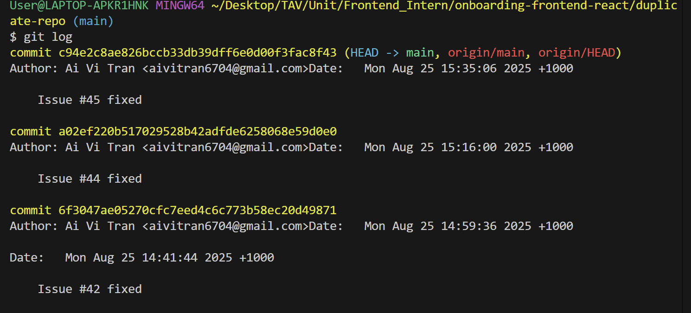

`git checkout main -- <file>`

### What?

Restores a specific file from another branch (in this case `main`) into the current branch, without switching the entire branch.

### When?

Useful if I only want to discard local changes to a single file or bring a clean version of a file from another branch.  
**Example**: While experimenting, I edited `app.js` in my `feature-ui` branch, but later realized I wanted the original version from `main`. Instead of resetting everything, I ran:
```bash
git checkout main -- app.js
```
### What surprise me most?

That it only overwrote the file I specified — the rest of my branch stayed untouched. It’s safer and more targeted than a full reset.

`git cherry-pick <commit>`

### What?
Applies the changes from a specific commit (by hash) onto the current branch, without merging the whole branch.
### When?
Ideal for hotfixes and backports.
**Example**: In my test repo, I fixed a bug in bugfix/login-error branch **(commit abc123)**. I needed the same fix in main, so I ran:
```bash
git checkout main
git cherry-pick abc123
```
### What surprise me most?

Even a small commit could cause conflicts if the surrounding code changed. The conflict resolution felt like a normal merge but was faster and more isolated.

`git log`

### What?
Displays commit history. With flags **(--oneline, --graph, --decorate)**, it can show detailed or simplified history.

### When?
- Auditing changes before a release.
- Finding a commit hash to cherry-pick.
- Understanding branch history during a review.

### What surprised I while testing these commands?
It showed not only the commits but also who made them and the relative branch structure, which helped me visualize merges better than GitHub’s UI.

`git blame`
### What?
Annotates each line of a file with the commit that last changed it.
### When?
To trace the history behind a specific line — who wrote it, when, and in which commit.
### What surprised I while testing these commands?
It gave immediate historical context line by line, making it much easier to understand intent without searching manually in logs.


*Figure 1: Git commands usage*