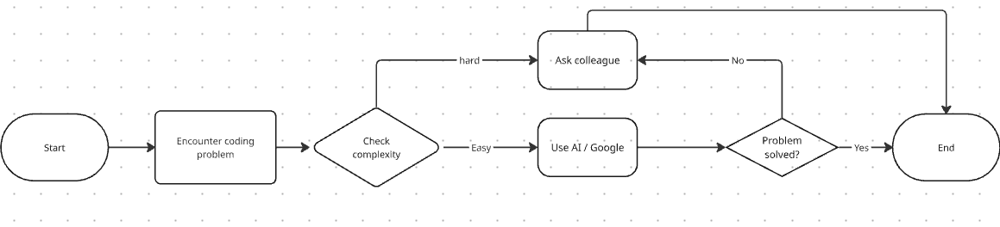

*Figure 1: Git commands usage*
## When do I prefer using AI versus searching Google?
I prefer using AI tools like ChatGPT when:
- I need quickly explanations, summaries, or conceptual understanding
- I want code snippets, pseudocode, or examples tailored to my current context.
- I am exploring different perspectives or brainstorming solutions to a problem
 -I want step-by-step guidance without digging through multiple sources.
 I prefer using Google when:
 - I need official documentation or highly reliable technical references 
 - I want to research error messages and see community solutions on forums like Stak Overflow.

 ## How do I decide when to ask a colleague instead>
 I ask a colleague when:
 - The problem is specific to our codebase, system, or internal tools, which AI or Google cannot fully understand.
 - The task involves team conventions or agreed practices (naming standards, architecture decisions, workflow rules)
 - The issue is blocking my progress and has an urgent impact on the team's delivery
 - I want to confirm assumptions and avoid misinterpretations that could waste time
 - Sharing the problem also helps with team knowledge sharing and ensures others learn from the issue

 ## What challenges do developers face when troubleshooting alone?
 - Information overload: Google can return too many possible solutions, making it difficult to filter the right one
 - Context gaps: AI may genrate helpful code but miss nuances about specific system setup or constraints
 - Debugging Blind Spots: Developers may get stuck due to tunnel vision and ovelook alternative approaches
 - Time pressure: Troubleshooting alone can be slow, especially when deadlines are tight
 - Confidence Issues: It is easy to doubt whether a fix is the best solution without peer review

