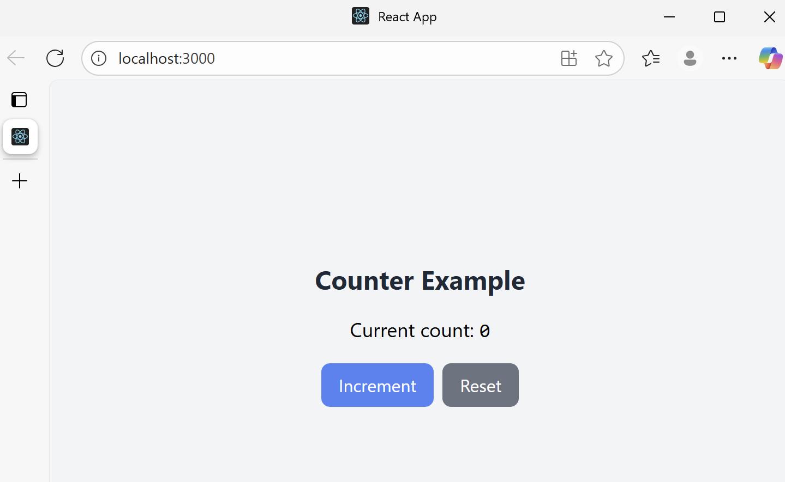

## What are the advantages of using Tailwind CSS?
Tailwind CSS allows for rapid development using utility classes, reducong the need to write custom CSS files. It ensures consistentstyling across components and makes it easy to apply responsive and modern designs directly inJSX. Since it is highly cusomizable through configuration, teams can quickly adapt Tailwind to fit rband guidlines while keeping styles organised and scalable.
## What are some potential pitfalls?
One drawback of Tailwind is that JSX cna become cluttered with too many untility classes, which can reduce readability. Developers unfamiliar with Tailwind's naming conventions may also face a learning curve whrn starting out. Additionally, without proper configuration and build optimisation, the generated CSS bundle can grow unecessary large, potentially affecting performance.
