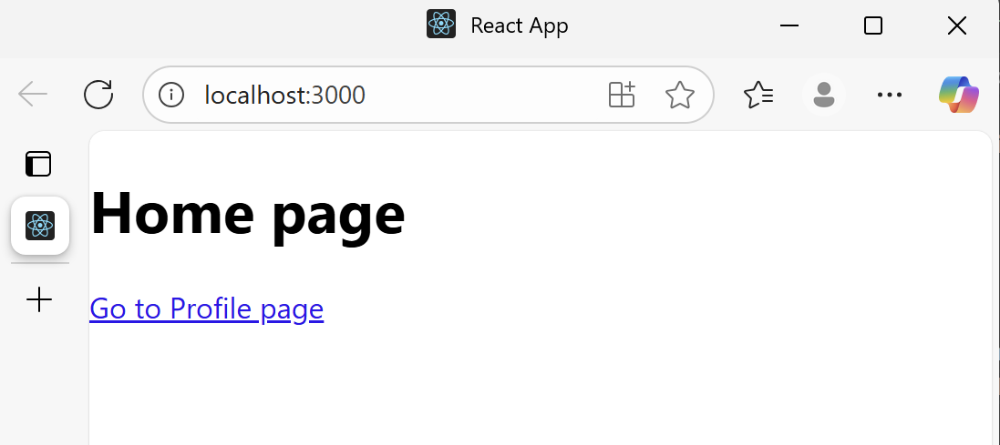

## Question: What are the advantages of client-side routing?

Client-side routing allows navigation between pages without requiring a full page reload from the server. This improves performance and provides a smoother user experience.

### Key advantages:
- **Speed**: Navigation feels instant because only part of the page updates rather than reloading the entire document.  
- **Better User Experience**: Transitions between views are seamless, making the app feel more like a desktop application.  
- **Reduced Server Load**: Since pages aren’t fully re-fetched from the server, fewer requests are sent.  
- **State Preservation**: Application state (e.g., user data, forms) can persist across navigation without resetting.  
- **Dynamic UI**: Routes can be conditionally rendered based on user roles, authentication, or context.  

Overall, client-side routing makes React apps **faster, more interactive, and more scalable**.
