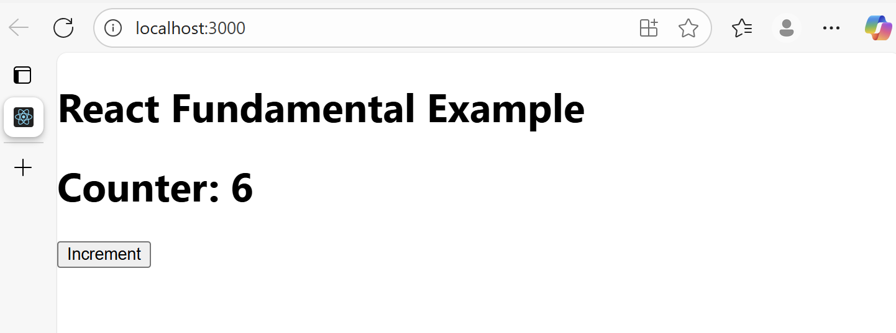

## What happens if we modify state directly instead of using setState?
If we midify state dorectly in React, such as doing `count = count + 1`, react will not detect the change and therefore will not trigger a re-render of the component. This means the UI will not update even though the underlying value has changed, leading to inconsistent behaviour betwene the state in memory and what the user sees on the screen. Directly mutating state also bypasses React's update cycle, which can cause unpredictanle bugs and make debugging much harder. For this reason, itis essential to always use the state stter function provided by React (like setCount) to ensure the UI in sync with the application's state.
